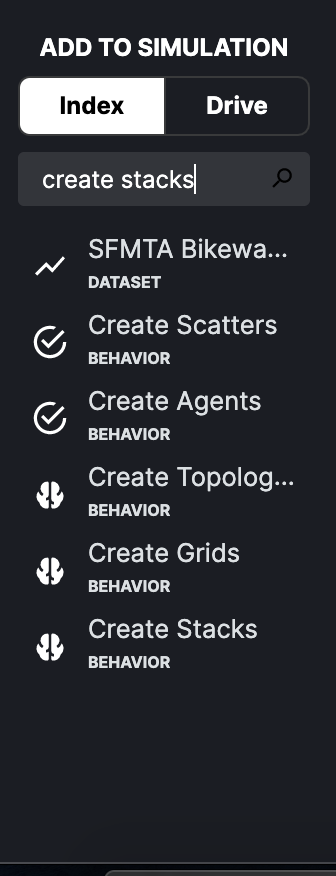

# Create a Hospital

Open up the `init.json` file. It should look like:

<Tabs>
<Tab title="JavaScript" >

```javascript
[
  {
    "behaviors": [
      "@hash/create-scatters/create_scatters.js",
      "create_people.js",
      "@hash/create-agents/create_agents.js",
      "@hash/remove-self/remove_self.js"
    ],
    "scatter_templates": [
      {
        "template_name": "homes",
        "template_count": 100,
        "height": 2,
        "color": "yellow"
      },
      {
        "template_name": "groceries",
        "template_count": 3,
        "height": 2,
        "color": "purple"
      },
      {
        "template_name": "offices",
        "template_count": 10,
        "height": 2,
        "color": "grey"
      }
    ],
    "people_template": {
      "behaviors": ["infection.js", "check_infected.js", "daily_movement.js"],
      "severity": "moderate",
      "out": false,
      "social_distancing": false
    }
  }
]
```

</Tab>

<Tab title="Python" >

```javascript
[
  {
    "behaviors": [
      "@hash/create_scatters.js",
      "create_people.py",
      "@hash/create_agents.js",
      "@hash/remove_self.js"
    ],
    "scatter_templates": [
      {
        "template_name": "homes",
        "template_count": 100,
        "height": 2,
        "color": "yellow"
      },
      {
        "template_name": "groceries",
        "template_count": 3,
        "height": 2,
        "color": "purple"
      },
      {
        "template_name": "offices",
        "template_count": 10,
        "height": 2,
        "color": "grey"
      }
    ],
    "people_template": {
      "behaviors": ["infection.py", "check_infected.py", "daily_movement.py"],
      "severity": "moderate",
      "out": false,
      "social_distancing": false,
      "infection_duration": 0,
      "infection_counter": 0,
      "type": "person"
    }
  }
]
```

</Tab>
</Tabs>

`init.json` defines the 'initial state' of the simulation. In this case we're using some 'creator' utility behaviors, attached to a setup agent, who plays no role in our experiments beyond helping get our world set up correctly.

<Hint style="info">
See [Initializing Agents](../../creating-simulations/anatomy-of-an-agent/initial-state.md) for more on init.json and creator agents.
</Hint>

This setup agent has four behaviors attached to it which will help populate our world. In order:

* First run `@hash/create-scatters/create_scatters.js`. This is a [shared behavior](../../creating-simulations/behaviors/) \([hIndex](https://hash.ai/@hash/create-scatters)\) that, when added to an agent, will create all of the associated "scatter\_templates". It's called _scatter_ because it's scattering the child agents around the map.
* Second it will run `create_people`, a behavior local to this simulation. In this behavior we've defined our people agents and associated them with their homes, offices, and groceries.
* Third is the `@hash/create-agents/create_agents.js` - another shared behavior \([hIndex](https://hash.ai/@hash/create-agents)\). In our previous two functions we didn't fully create our agents, we just added them to an agents object on the "creator agent". This third behavior iterates through that object and sends messages to the [reserved hash keyword create\_agent](https://app.gitbook.com/@hash-1/s/core/~/drafts/-M3yIAt-weMIyGiVronu/agent-messages/built-in-message-handlers) to instantiate all of our new agents.
* Finally the agent runs `@hash/remove-self/remove_self.js`, which will appropriately enough remove itself from the simulation. We don't want to constantly be generating new grocery stores, which is what we'd end up with here otherwise!

This kind of 'creator agent' pattern is a common and recommended method for generating lots of agents. It’s worth double-checking to make sure fully understand what's going on in this step.

Now that we understand how to instantiate our agents, let’s create a hospital. Since we’re not dynamically generating multiple hospitals, we could just add the hospital directly in our `init.json` initial state page.

```javascript
{
  "agent_name": "Hospital",
  "position": [0, 0],
  "height": 4,
  "color": "blue",
  "behaviors": [],
  "type": "hospital"
}
```

Or, we can follow the creator pattern and add it as a "stack" \(as it's at a specific location\). To do that we'd add `stack_templates` to our agent, as well as add the `@hash/create-stacks/create_stacks.js` behavior. Since it's a shared behavior, you can search in the index panel in the lower left for it. Double click and it will be added to your simulation.



<Tabs>
<Tab title="JavaScript" >

```javascript
[
  {
    "behaviors": [
      "@hash/create-scatters/create_scatters.js",
      "@hash/create-stacks/create_stacks.js",
      "create_people.js",
      "@hash/create-agents/create_agents.js",
      "@hash/remove-self/remove_self.js"
    ],
// ...
    "stack_templates": [
      {
        "template_name": "hospitals",
        "template_count": 1,
        "template_position": "center",
        "agent_name": "Hospital",
        "behaviors": [],
        "height": 4,
        "color": "blue"
      }
    ]
  }
]
```

</Tab>

<Tab title="Python" >

```javascript
[
  {
    "behaviors": [
      "@hash/create-scatters/create_scatters.js",
      "@hash/create-stacks/create_stacks.js",
      "create_people.py",
      "@hash/create-agents/create_agents.js",
      "@hash/remove-self/remove_self.js"
    ],
// ...
    "stack_templates": [
      {
        "template_name": "hospitals",
        "template_count": 1,
        "template_position": "center",
        "agent_name": "Hospital",
        "behaviors": [],
        "height": 4,
        "color": "blue"
      }
    ]
  }
]
```

</Tab>
</Tabs>

You can set the position, color, and height as whatever you’d like.

* Position is an \[x,y\] array that determines the location of the agent on the 3D viewer.
* Height can be any integer - the default size is 1. 

Click Reset Simulation in the bottom right under the 3D viewer. If you added the hospital directly to `init.json` you should see it appear in the viewer - if you're using `create_stacks` then click Start Simulation. After three frames you should see it. Congratulations, you’ve built your first hospital! We’re proud of you.

At the moment the hospital doesn’t do anything. It just sits there, begging for a purpose. So let's add some functionality. There’s two things we want our hospital to do.

1. **Provide tests to people.** If a person is infected and suspects they are sick, they should be able to contact the hospital and request a test. The hospital will see if they’re sick and send them the results.
2. **ICU capacity.** If a person is really sick, they get admitted into the hospital’s ICU. The hospital should only have a limited set of beds, and if they’re over capacity the person will be turned away.

